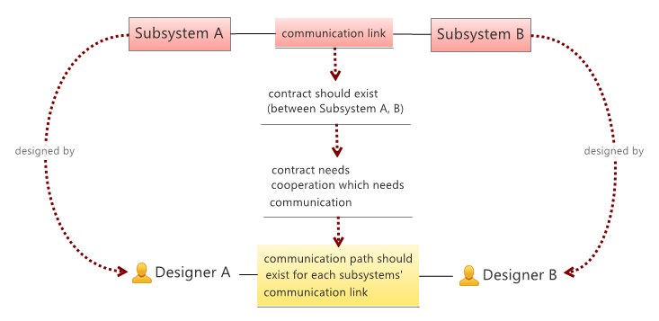

An introduction and proof of Conway law
==

By Gyula Csom  
Updated: 2015.08.25.  
Download: [Conway_law.pdf](Conway_law.pdf)

Visual proof
--

### Conway law

Conway's law states that

> organizations which design systems ... are constrained to produce designs which are copies of the communication structures of these organizations

-- **[Melvin E. Conway: How Do Committees Invent?](http://www.melconway.com/Home/Committees_Paper.html)**

A simple visual proof using the concept of the original paper is the following:

### structure of the system

1. Complex systems are typically designed using a divide-and-conquer approach. That is **the system is decomposed into smaller subsystems**, until the complexity becomes manageable by the individual designer (or designer group).
2. **Subsystems need to communicate each other** (in some meaningful way specific to the domain the system deals with). This is necessary in order to act as a whole, that is as a system.
3. **Subsystems and subsystem communications define a graph-like structure** where the nodes are the subsystems and the edges are the direct communication links between subsystems. 

### *designed by* relation

1. **Every subsystem is *designed by* a designer** (or designer group), which then creates a mapping from subsystems to designers (or designer groups). 

*Note that the original paper uses the term designer. Meanwhile in the IT world there's a tendency to blur the frontier between designers and programmers (ie. eat your own dog food). Hence within the IT domain, nowadays probably one can replace designers with developers in the above statement. There is an emphasis on "IT domain", since Conway law applies to other domains as well, not just to the IT domain.*

### relation between system- and human communication links

1. **When two subsystems communicate each other, they require an agreed upon contract which governs their communication.** 
2. **This contract (since it is a contract) should be based on the agreement between the corresponding designers.** That is it must be the result of some cooperation between the designers of the two subsystems. Since cooperation needs some communication, hence: 
3. **There should be a communication link between the designers who designed such subsystems which directly communicate each other**. This then creates a mapping between the (communication) links of the subsystems and the (communication) links between the designers who designed them. 

*Note that there is a special case, when two subsystems are designed by the same designer. If we want to deal with this situation as well, then generally we can say the following. Each link between subsystems is either (a) mapped to the same designer if she designed both systems or (b) mapped to two designers if different persons (groups) designed them. Either the designer is the same, or at least they communicate each other.*

Practical considerations
--

### A common misunderstanding

A common misunderstanding of the law is that (it states that) every system mirrors the static structure of the organization who designed it. Conway law does not state that:

* The "static structure" often means the functional decomposition of the organization, ie. the organization split into functional organization units dealing with regular/recurring tasks.
* Meanwhile "organization structure" in Conway law does not mean anything but the communication structure during the design of the system and between the designers of the system. 

If we want to seek a common term that is close to the above meaning then it would be rather the "dynamic structure" or "project structure" of the organization. But even this could be different (ie. if the project structure diverges from the real relationship between designers). 

When Conway law speaks about organization structure it speaks about two things:

* the communication structure, ie. the communication of designers
* the politics governing/constraining such communication

It is the latter which shares some commonalities with the organization's static structure - policies could be rather static (slowly changing). This leads to the following:

### Communication vs system constraints

If the communication between designers are constrained by some rules (ie. there are restrictions on who can talk to whom), then the same rules would constrain the system itself as well. This is written by Conway as follows:

> organizations which design systems ... are constrained to produce designs which are copies of the communication structures of these organizations. 

Quasi-formal proof
--

The above visual proof could be more-or-less formalized if the core terms/assumptions are defined. This is what we do in this chapter. However:

*Note that the emphasis is not on the formal proof. Personally I think that the original paper speaks for itself, so does the visual proof above. Instead we focus on collecting the core assumptions behind the law. This is the main goal: it is necessary to see the assumptions behind the law in order to see its applicability.*

### Terms

Let's collect terms first:

1.	**Communication structure** means the communication between designers which yields a graph-like structure, where (I) vertices represent designers, and (II) edges represent communications between designers, ie. two designers are linked iff they communicate. 
2.	**System structure** is the decomposition of the system into subsystems, which again yields a graph-like structure, where (I) vertices are subsystems and (II) edges are the links between subsystems directly communicating each other.
3.	**Designed-by** is the relation between a subsystem and its designer.

*Notes*:

* Designer could mean either an individual or a group of designers.
* In case of groups communication means that some individual in one group communicate some individual in the other group.
* When a subsystem is designed by more than one individual, designed by means (maps to) the whole group containing every designer who contributed to the design. 

### Statement

After all the law states the following:

**The communication structure is the homomorphic image of the system structure using the designed-by relation as the mapping.**

*Note that [homomorphism](https://en.wikipedia.org/wiki/Group_homomorphism) is used in the algebraic sense and must not be confused with the similar but different term: [homeomorphism](https://en.wikipedia.org/wiki/Homeomorphism_%28graph_theory%29). The former is a weaker statement, means that the communication structure is a (structure preserving) projection of the system structure, however it doesn’t mean the opposite. Meanwhile the latter would mean that the two structures are equivalent, which is generally not true.*

In order to prove the above statement, the basic premises should be also stated:

### Premises

Conway law builds upon the following premises:

1.	**Designed-by relation** is well defined: For each subsystem there is a designer who designed it (could be either an individual or a group of designers).
2.	**System integration relies upon contract**: If two systems are integrated with each other then there must be a contract between them. In case of IT systems these contracts are typically called API-s.
3.	**Contract relies upon agreement**: If a contract exists between two subsystems then it must be the result of an agreement between the parties who designed these systems.
4.	**Agreement between parties relies upon communication**: If an agreement exists between two parties then they communicated with each other.

### Proof

The proof is evident, in fact the visual proof already did the work when using the above terms/premises as evidences. Let’s replay it: If two subsystems are integrated then:

* From Premise 2 it follows that there’s a contract between the systems. Hence:
* From Premise 3 it follows that there’s an agreement between their designers. Hence:
* From Premise 4 it follows that their designers communicate.

That is if there’s an integration link between the two subsystems then there’s a communication link between their designers. Hence the designed-by relation is a homomorphism.

After all we got that: if the premises hold then so does Conway law.

*Note that to be precise we should handle special cases, like the following ones: two subsystems are designed by the same designer, designer groups are not disjoint. Formally this could be handled in many different ways. The details are left to the reader.* 

Practical questions
--

As mentioned before the main goal of the formal proof was to collect the basic assumptions behind the law. Now let’s focus on these basic terms/assumptions:

### Direct vs. indirect communication

One basic term/assumption behind the law is (I) communication and (II) the fact that integration needs contracts, which then needs human cooperation and communication. The following phenomenon shows that this term/assumption might not be that trivial:

**In the IT domain it is very common to produce open interfaces, when direct/online communication between designers is not (always) the norm. In fact open systems might yield a slightly different type of cooperation/agreement between developers, different from direct peer-to-peer agreements.**

For instance both webservers and web browsers should adhere to the http specification. However this does not necessarily mean that each webserver/browser developer participated in the http specification or directly communicated each other. In fact this would be unrealistic. Instead reading the http specification and probably googling the web and participating in open conversations could be just enough to implement a standard compliant web server or web browser.

Formally speaking, this probably leads to the extension of „cooperation” and „communication". Besides direct „face-to-face” communications, we should cover indirect communications as well, like communication through (open) specifications or through any other form of communication which is not direct/online. 

Practically speaking, my intuition and some experience say that even if your specification is the best-written one, it still needs some support. It could be the support directly from you, the author or the support provided by a dedicated team (trained by you, the author) or a crowd-support provided by the community (ie. stackoverflow). In either case some form of support is necessary during the specification’s lifetime.

### Cross-system contracts

Another basic assumption behind the law is that communication happens in a peer-to-peer manner. The peers could be either individuals or groups but in either case the communication happens between two entities. Hence rules governing communication should deal with pair of peers. The following phenomenon shows that this assumption might not be always the case:

**Sometimes business processes/rules span many subsystems. In this case the "contract" (participating subsystems must adhere to) does not only effect two nodes, but could effect a wider set of participating systems (linked either directly or indirectly).**  
**In this case it might not be enough just to ensure peer-to-peer communications, instead it might be necessary to ensure communication between the sets of parties.**

For instance a set of three designers who design three different but related subsystems could discuss one shared topic in a peer-to-peer manner. This would then lead to at least 2-3 separate discussions between the pairs of peers until a mutual agreement is reached. Instead of this it could more effective to hold just one session where each designer participate.

History
--

* 2015.08.25 - Added graphic to illustrate indirect communication 
* 2015.08.24 - Editorial updates
* 2015.08.22 - Description of a common misunderstanding, added quasi-formal proof
* 2015.06.01 - Original version
